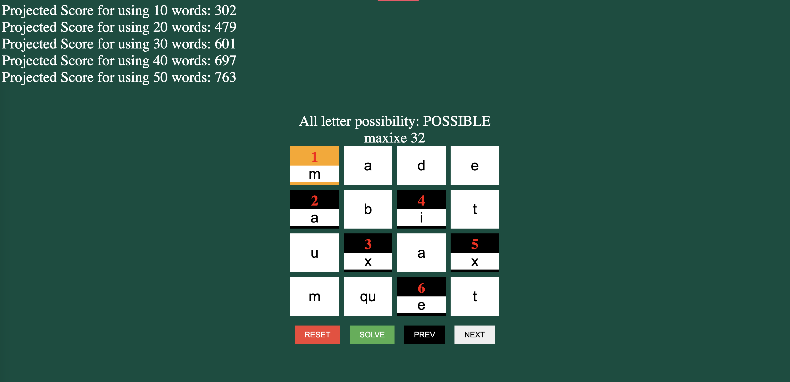

# Boggle Solver

## Overview
This project is a fully functioning **Boggle solver** built using **Flask** and **Python**. The solver efficiently finds valid words on a 4x4 Boggle board, leveraging a **Trie-based search algorithm** and **depth-first search (DFS)** for word optimization and board coverage.

The frontend allows users to interact with the Boggle board directly, and the solver is designed to maximize word scores, taking into account special tile bonuses (double/triple letter/word scores). The solver has achieved a **90% win rate**.

## Features
- Trie-based algorithm for efficient word searching.
- Depth-first search (DFS) to explore all possible word combinations on the board.
- Fully functional frontend for direct user interaction.
- Score calculation based on letter values, word length, and special tile bonuses.
- Projected score output for top-N word selections.
- High board coverage with an optimized word selection strategy.

## Technologies Used
- **Flask**: Backend framework to handle API requests.
- **Python**: Used for the core logic of word searching and scoring.
- **HTML/CSS/JavaScript**: Frontend to interact with the Boggle board.
- **Trie Data Structure**: For fast word search and lookup.

## How It Works
1. **Trie-based Word Search**: The backend loads a word list into a Trie, enabling fast lookup of valid words based on the letters on the board.
2. **Board Scanning with DFS**: The solver uses DFS to scan the board for all possible letter combinations, checking each path against the Trie for valid words.
3. **Score Calculation**: The solver assigns points based on letter values, word length, and any double/triple letter/word bonuses on the board.
4. **Front-End Interaction**: Users can input a Boggle board through a simple interface, and the solver will return the top-scoring words, projected scores, and optimal paths.

## Getting Started
- Clone repository
- Get backend server running:
  - cd api
  - python api.py
- Get frontend server running:
  - cd boggle
  - npm run start

## Game Screen


### Prerequisites
- **Python 3.x**
- **Flask**: Install Flask via pip:
  ```bash
  pip install Flask
